<div align="center">


# NAADI · नाड़ी

**Reading the financial pulse of India's 64 million MSMEs.**

*An AI-native Financial Health Card and an agentic underwriting copilot,<br/>built for businesses the balance sheet never sees.*

<br/>


<br/>


<br/>


</div>

> *Just as a vaidya reads the **naadi** — the pulse — to diagnose the whole body, NAADI reads GST, UPI, Account Aggregator and EPFO flows to diagnose the whole business. In seconds. With every point explained.*

<br/>

## The problem, as the Bank stated it

MSME credit evaluation leans on audited financials that **New-to-Credit and New-to-Bank enterprises simply don't have**. Meanwhile rich alternate data sits unused across four consented rails. No unified framework → high rejection rates, missed viable borrowers, slow financial inclusion.

The borrowers exist. The data exists. **The bridge doesn't.** NAADI is the bridge.

## One pulse, five superpowers

**`score → reasons → decision → memo → monitoring`** — most entries stop at the first step. NAADI closes the whole loop.

| | What it does | Why it wins |
|---|---|---|
| 🩺 **The Health Card** | Six dimensions — Liquidity · Stability · Growth · Repayment · Compliance · Concentration — composed into a calibrated PD(12m) and a 300–900 score **with an honest confidence band** | A committee-ready diagnosis, not an opaque number |
| 🔍 **Glass-box scoring** | Monotone LightGBM scorecards + native TreeSHAP reason codes in plain language | *"more bounces can never raise the score"* — directionality a credit committee can trust |
| 🪄 **The what-if engine** | Counterfactuals over actionable levers only: *"file GSTR-3B on time for 3 months → **+24 pts**"* | Every decline ships with a comeback path — scoring becomes financial literacy |
| 📉 **Portfolio radar** | Rolling 12-month rescore per MSME with an early-warning threshold — deterioration surfaces **quarters before default** | Origination *and* monitoring from the same brain (a free bridge into Track 04) |
| 🧾 **Munshi, the copilot** | An agentic pipeline (Claude Opus 4.8) drafts the full sanction memo — decision, limit, tenor, covenants, triggers — every figure injected by the deterministic engine | **The LLM writes prose, never numbers.** Officer reviews, clicks approve. Minutes, not weeks |

Plus the console details judges remember: a **⌘K command palette** across the book, a **stress lab** (adverse scenarios rescored, not guessed), **peer percentile benchmarks** per sector, a **replayable agentic run** with real pipeline timings, and a **print-ready sanction memo** that turns into bank paper.

<div align="center"></div>

## The demo book — real engine output

Eight named MSMEs, generated by a latent-risk process and scored by the trained brain. Every number below came out of the pipeline, not a slide:

| File | Who | Tier | Score | Grade | PD 12m | Munshi says |
|---|---|:--:|:--:|:--:|:--:|---|
| `MSME-2401` | **Chandra Kirana Stores**, Indore — the hero: no balance sheet, no bureau file | T1 | **762 ± 40** | A | 1.4% | ✅ Approve **₹9.2L / 36 mo** |
| `MSME-2402` | **Meenakshi Textiles**, Surat — strong book, one buyer = 56% of revenue | T3 | 711 ± 15 | B | 2.0% | ✅ Approve, concentration covenant |
| `MSME-2405` | **Shree Balaji Pharma**, Nagpur — the benchmark | T3 | 805 ± 15 | A+ | <0.1% | ✅ Pre-approved |
| `MSME-2404` | **Blue Tiffin Kitchens**, Bengaluru — hyper-growth, volatile | T2 | 632 ± 25 | C | 6.5% | 🟡 Refer |
| `MSME-2407` | **Noor Fashion House**, Lucknow — formalising fast | T1 | 632 ± 40 | C | 6.5% | 🟡 Refer |
| `MSME-2406` | **Kaveri Agri Tools**, Coimbatore — monsoon-cycle cashflows | T2 | 621 ± 25 | C | 6.5% | 🟡 Refer |
| `MSME-2408` | **Ganpati Constructions**, Ahmedabad — lumpy govt receivables | T2 | 543 ± 25 | D | 21.9% | 🟠 Starter product |
| `MSME-2403` | **Rathod Auto Components**, Pune — sliding for five months | T3 | 442 ± 15 | E | 62.9% | 🔴 Decline — **flagged all year by the radar, beats only 6% of sector peers** |

The wide `± 40` on the thin-file cases is the point: **NAADI widens uncertainty instead of penalising data poverty.**

## See it in 90 seconds

```bash
# 1 · the engine — generate, train, validate, export
cd engine
uv sync && uv run python scripts/build_demo.py

# 2 · the console
cd ../web
npm install && npm run dev        # → http://localhost:3000
```

Then walk the demo:

1. **The book** — eight files, live validation chips, grade distribution. Press <kbd>⌘K</kbd> and type *"kirana"*.
2. **The hero** — Chandra Kirana Stores: watch the needle sweep to **762**, six dimensions radar in, *"beats 78% of Retail Trade peers"*.
3. **▶ Replay Munshi's run** — consent → four rails → 27 features → score → policy → memo, with real timings.
4. **The radar** — open Rathod Auto: the trajectory has been under the early-warning line **all year**. Nobody at the branch is surprised.
5. **The memo** — evidence-linked, covenants armed, `⎙ print` turns it into sanction paper.

Optional extras: `uv run uvicorn naadi.api:app --port 8000` for the `POST /score` decision API · `--live-memos` (with `ANTHROPIC_API_KEY`) lets Munshi polish memos through Claude — with a deterministic fallback so the stage demo can never break.

## How it works

```mermaid
flowchart LR
    subgraph RAILS["consented rails"]
        GST["GSTN<br/>GSTR-1/3B"]
        UPI["UPI<br/>txn aggregates"]
        AA["Account<br/>Aggregator"]
        EPFO["EPFO<br/>payroll"]
    end
    subgraph BRAIN["the scoring brain"]
        FEAT["27 point-in-time<br/>features"]
        DIMS["6 monotone LightGBM<br/>scorecards L·S·G·R·C·K"]
        COMP["composite → isotonic<br/>PD(12m) → 300–900"]
        XAI["TreeSHAP reason codes<br/>+ what-if + stress lab"]
    end
    subgraph MUNSHI["Munshi — agentic copilot"]
        POL["policy & limit engine<br/>(deterministic)"]
        MEMO["sanction memo<br/>Claude writes prose only"]
    end
    RAILS -->|"consent-first · DPDP"| FEAT --> DIMS --> COMP --> XAI --> POL --> MEMO
    MEMO --> OUT["console · LOS API<br/>ULI / OCEN rails"]
```



<details>
<summary><b>🧮 The scoring math, honestly</b></summary>
<br/>

- **Two layers**: six per-dimension scorecards (monotone constraints, so bad signals can only hurt) → percentile subscores → a composite model over the subscores → **isotonic calibration** on a held-out fold → PD(12m) → log-odds-scaled 300–900 score.
- **Thin-file tiers**: T1 (UPI-first) → T3 (full stack). Sparse rails **widen the confidence band** instead of silently penalising the borrower.
- **Why not "90% accuracy"?** Default is a rare event; raw accuracy is a broken yardstick. We report **AUROC 0.871 / KS 0.576** held-out — and we'll defend why that's the right metric.
- Everything here is **synthetic-population validation of the architecture** — not a market claim. The connector layer swaps to IDBI sandbox data (Jul 22) with zero downstream changes.

Full detail: [`docs/SCORING.md`](docs/SCORING.md)
</details>

<details>
<summary><b>🛡️ Munshi's guardrails</b></summary>
<br/>

- Deterministic pipeline: `verify_consent → pull_rails → features → score → policy → memo → officer_review`.
- The LLM receives a **structured fact sheet** and writes narrative around it — it cannot invent, alter, or drop a figure.
- Every claim carries an **evidence anchor** back to a feature; every decline routes through a human.
- Offline template fallback ships in the box: no API key, no network, no problem.

Full detail: [`docs/ARCHITECTURE.md`](docs/ARCHITECTURE.md)
</details>

<details>
<summary><b>📁 Repository layout</b></summary>
<br/>

```
docs/      ARCHITECTURE.md · SCORING.md · PITCH.md · assets
engine/    Python 3.13 · uv · Polars · DuckDB · LightGBM · FastAPI · Claude
  ├─ src/naadi/        personas → generate → features → scoring → explain → limits → munshi → api
  └─ scripts/          build_demo.py (train + validate + export)
web/       Next.js 16 · React 19 · Tailwind v4 · Motion · Recharts (fully static)
  └─ src/              app (book, health card) · components (dial, radar, ledger, replay, ⌘K)
```
</details>

## The stack, deliberately bleeding-edge

| Layer | Choices |
|---|---|
| **Console** | Next.js 16 (App Router, Turbopack) · React 19 · Tailwind CSS v4 · Motion 12 · Recharts 3 |
| **Engine** | Python 3.13 · uv · Polars · DuckDB · scikit-learn 1.9 · LightGBM 4.6 |
| **ML** | Monotone scorecards · isotonic calibration · native TreeSHAP · counterfactual what-ifs · feature-space stress |
| **Copilot** | Claude Opus 4.8, adaptive thinking · deterministic offline fallback |
| **Scale path** | Kafka → Iceberg · Feast · MLflow · EKS · OpenTelemetry · Langfuse |

## Road to demo day

| Date | Milestone |
|---|---|
| **Jul 9** | ✅ Concept submission — docs, trained engine, working console (this repo) |
| **Jul 22–31** | Sandbox: retrain on IDBI data, publish validation report, live-data demo |
| **Aug 13** | Demo day — end-to-end consented flow |
| Beyond | LOS integration · pilot branch cohort · swap-set study · ULI/OCEN embedded journeys |

<div align="center">


*नाड़ी — the pulse. A vaidya reads it to diagnose the body.*<br/>
***NAADI reads it to diagnose a business.***

**Team NAADI** · IDBI Innovate 2026 · Track 03 · *"Build. Integrate. Transform."*

</div>
