# NAADI — System Architecture

> **Track 03 · Financial Health Score · IDBI Innovate 2026**
> AI-native MSME Financial Health Card + agentic underwriting copilot.

## 1. TL;DR

NAADI turns four consented alternate-data rails — **GST, UPI, Account Aggregator (AA), EPFO** — into a six-dimension, explainable **Financial Health Card** and a calibrated probability-of-default, then hands the loan officer a finished, evidence-linked **underwriting memo** drafted by an agentic copilot (**Munshi**). It is designed to plug into **ULI / OCEN 4.0** rails so credit decisions happen in near-real-time where MSMEs already transact.

**Design principles**

1. **Consent-first** — no data moves without a DPDP-compliant consent artefact; every pull is logged in an immutable consent ledger.
2. **Explainable by construction** — every score ships with SHAP-derived reason codes; monotone model constraints keep behaviour intuitive for credit committees.
3. **LLMs write prose, never numbers** — Munshi narrates; every figure in a memo is injected from the deterministic scoring engine, with evidence links.
4. **Thin-file native** — the score degrades gracefully across data-availability tiers instead of rejecting credit-invisible MSMEs.
5. **Swap-ready** — synthetic data today, IDBI sandbox data (July 22) tomorrow, with zero schema changes.

## 2. Product surfaces

| Surface | User | What they get |
|---|---|---|
| **Health Card app** | Loan officer / RM | Portfolio dashboard, per-MSME six-dimension card, reason codes, red flags, Munshi memo |
| **MSME view** | Borrower | Their own card + concrete "how to improve my score" guidance → financial literacy loop |
| **Decision API** | IDBI LOS / LLMS | `POST /score` → score, PD, grade, limit, reason codes (JSON) for straight-through processing |
| **ULI / OCEN hooks** | Ecosystem | NAADI as a Derived-Data / underwriting service on embedded-lending rails |

## 3. System overview

```mermaid
flowchart LR
    subgraph SOURCES["Consented data rails"]
        GST["GSTN APIs\nGSTR-1 / GSTR-3B"]
        UPI["UPI txn aggregates\n(PSP / bank switch)"]
        AA["Account Aggregator\n(Sahamati FI data)"]
        EPFO["EPFO ECR\npayroll signals"]
        UDY["Udyam / PAN / CKYC\nidentity spine"]
    end

    subgraph CONSENT["Consent & trust layer"]
        CM["Consent manager\nAA artefacts · GSTN OTP · DPDP purpose binding"]
        LEDGER["Immutable consent + audit ledger"]
    end

    subgraph PLATFORM["Feature platform"]
        ING["Connectors + normalizers\n(Pydantic v2 contracts)"]
        FS["Feature store\nPolars + DuckDB (demo) → lakehouse (scale)"]
    end

    subgraph BRAIN["Scoring brain"]
        DIM["6 dimension subscores\nmonotone LightGBM scorecards"]
        PD["Composite PD model\n+ isotonic calibration"]
        XAI["SHAP explainer\n→ reason codes + what-if engine"]
        POL["Policy & limit engine\ncash-flow affordability rules"]
    end

    subgraph MUNSHI["Munshi — agentic copilot"]
        AGENT["LangGraph orchestration\nClaude (Opus 4.8 / Fable 5)"]
        MEMO["Underwriting memo\ndecision · limit · covenants · evidence links"]
    end

    SOURCES --> CM --> ING --> FS --> DIM --> PD --> XAI --> POL --> AGENT --> MEMO
    CM --> LEDGER
    MEMO --> APP["Health Card app / LOS API / ULI-OCEN"]
```



## 4. Data plane — sources & contracts

| Rail | What we pull (consented) | Signal it carries | Access path |
|---|---|---|---|
| **GSTN** | GSTR-3B monthly summaries, GSTR-1 sales registers, filing metadata | Real turnover, growth, B2B vs B2C mix, filing discipline | GSP APIs, OTP-based taxpayer consent |
| **Account Aggregator** | Bank statement FI data (deposits, balances, bounces) | Cash reality: balances, inflow/outflow, EMI bounces, EOD stress | Sahamati AA framework, FIU registration, consent artefact |
| **UPI** | Merchant-side txn aggregates (count, value, payer diversity, refunds) | Daily revenue pulse, customer breadth, seasonality | Bank switch / PSP partnership; sandbox dataset in hackathon |
| **EPFO** | ECR filings: headcount, wage base, payment regularity | Formal employment, stability, wage growth | Employer-consented ECR fetch |
| **Udyam / PAN / CKYC** | Registration, sector (NIC code), vintage, identity | Segmentation spine + KYC dedupe | Udyam verify APIs, CKYC |
| *(optional)* Bureau | Existing tradelines where present | Repayment history for not-fully-NTC | CIC pull post-consent |

Every connector lands raw payloads into an immutable bronze zone, then normalizes to **versioned Pydantic v2 contracts** (silver). Features are computed **point-in-time correct** (as-of joins) so training never leaks future data — the classic credit-model failure we design out on day one.

## 5. Consent, privacy & compliance

- **DPDP Act 2023**: purpose-bound, time-bound consent; per-purpose data minimization; erasure workflows.
- **AA framework**: consent artefacts (XML/JSON) stored with hash-chained audit entries in the consent ledger.
- **RBI Digital Lending Guidelines**: all data flows via regulated entities; no scraping, no device-data grabs.
- **Security**: KMS-managed encryption at rest, TLS 1.3 in transit, PII tokenization at ingestion (GSTIN/PAN → surrogate keys), role-based access, secrets in vault, VPC-isolated model serving.
- **Model governance**: model cards, versioned features + models, human-in-the-loop for every decline (the officer, not the model, declines), fairness monitoring by sector/geo/vintage slices.

## 6. Feature platform

**Demo (this repo)**: Polars pipelines + DuckDB — zero-infra, columnar, wicked fast on a laptop; identical SQL/expressions later port to the lakehouse.

**Scale path (post-PoC)**: connectors stream to Kafka → Iceberg lakehouse; **Feast** feature registry serves online (Redis) + offline (Iceberg) with the same definitions; dbt for transformation lineage; great-expectations data-quality gates at every hop.

Feature families (27 engineered features in the demo engine, scaling to 100+ on production rails): turnover level/trend/volatility, filing-delay distributions, ITC utilization, inflow-outflow ratios, balance percentiles, EOD-negative days, bounce counts, UPI payer-concentration (HHI), refund rates, weekday/festival seasonality fingerprints, payroll regularity, wage-base growth, sector-relative z-scores.

## 7. Scoring brain

Two-layer design — **interpretable subscores, calibrated composite**:

1. **Six dimension subscores** (0–100 each): monotone-constrained LightGBM scorecards per dimension (Liquidity, Stability, Growth, Repayment, Compliance, Concentration). Monotonicity = a credit committee can trust directionality ("more bounces can never raise the score").
2. **Composite PD model**: gradient-boosted ensemble over the subscores + interaction features → **isotonic calibration** → PD(12m). Score = log-odds-scaled PD mapped to the familiar **300–900** band; grades A+ → E.
3. **Uncertainty**: conformal prediction interval on PD; thin-file tiers widen the band and the card shows **score confidence** honestly.
4. **Challenger track**: TabPFN-v2 / FT-Transformer benchmarked each retrain; champion promotes only on out-of-time AUROC + calibration + stability wins.

Serving: **FastAPI** (Python 3.13, Pydantic v2) → `POST /score` p95 < 300 ms on cached features; end-to-end consent→card < 3 s target on ULI flows.

## 8. Explainability service

- **SHAP** TreeExplainer on every request → top ± contributions → mapped through a governed **reason-code dictionary** (plain English + Hindi) so the same code feeds the officer memo, the MSME's improvement tips, and adverse-action reporting.
- **What-if engine**: constrained counterfactual search over *actionable* features only ("file GSTR-3B on time for 3 months", "reduce top-payer share below 40%") → each tip shows estimated score uplift. This turns a score into a financial-inclusion product.

## 9. Munshi — the agentic underwriting copilot

A **LangGraph** state machine, powered by **Claude** — with hard guardrails:

```
verify_consent → pull_features → score → policy_check → draft_memo → evidence_link → officer_review
```

- Deterministic tools do all math; Claude receives a **structured fact sheet** (scores, PD, limits, reason codes, flags) and writes the narrative memo — recommendation, rationale, covenants, early-warning triggers.
- Every claim in the memo carries an **evidence anchor** back to the underlying feature (auditable, reg-friendly).
- Memo ends at a **human decision gate** — Munshi recommends; the officer decides. Structured outputs (JSON schema-enforced) keep downstream LOS integration clean.
- Offline fallback: template renderer produces the same memo without an API key (demo never breaks on stage).

## 10. What's in this repo vs. the scale story

| Layer | Demo build (this repo) | Production path |
|---|---|---|
| Data | Synthetic persona generator (8 archetypes, 5k-population) | IDBI sandbox (Jul 22) → live rails |
| Features | Polars + DuckDB | Kafka → Iceberg + Feast |
| Models | LightGBM + SHAP, trained in-repo, artifacts versioned | Same + challenger CI, MLflow registry |
| Serving | FastAPI local | K8s on AWS (EKS), autoscaled, OpenTelemetry traced |
| Copilot | LangGraph + Claude w/ offline fallback | Same + Langfuse eval traces, prompt registry |
| App | Next.js (App Router, Turbopack) | Same, deployed at edge |

## 11. Bleeding-edge stack

| Layer | Choice | Why |
|---|---|---|
| Web | **Next.js 16 · React 19 · Turbopack** | RSC + streaming UI, instant HMR |
| Styling | **Tailwind CSS v4** | CSS-first config, OKLCH color pipeline |
| Motion | **Motion (Framer successor)** | The live-scoring reveal animation |
| Charts | **Recharts** | Radar, gauges, sparklines |
| Engine | **Python 3.13 · uv · FastAPI · Pydantic v2** | Fastest modern Python toolchain |
| Data | **Polars · DuckDB** | Columnar speed, laptop-to-lakehouse portability |
| ML | **LightGBM (monotone) · SHAP · conformal PD bands** | Credit-grade interpretability |
| Agent | **LangGraph · Claude Opus 4.8 / Fable 5** | Deterministic orchestration, frontier reasoning |
| Ops (path) | EKS · Feast · MLflow · OpenTelemetry · Langfuse | Bank-grade MLOps story |

## 12. Sandbox swap plan (Jul 22–31)

1. Map sandbox schemas → our Pydantic contracts (connector layer only; features untouched).
2. Retrain per-dimension + composite on sandbox population; re-calibrate; publish validation report (AUROC, KS, calibration curves, PSI, fairness slices).
3. Point the app at the FastAPI service over sandbox features; demo the same UI on real (anonymized) MSMEs.

*The demo you see is the architecture we'd ship — just with the data faucet swapped.*
